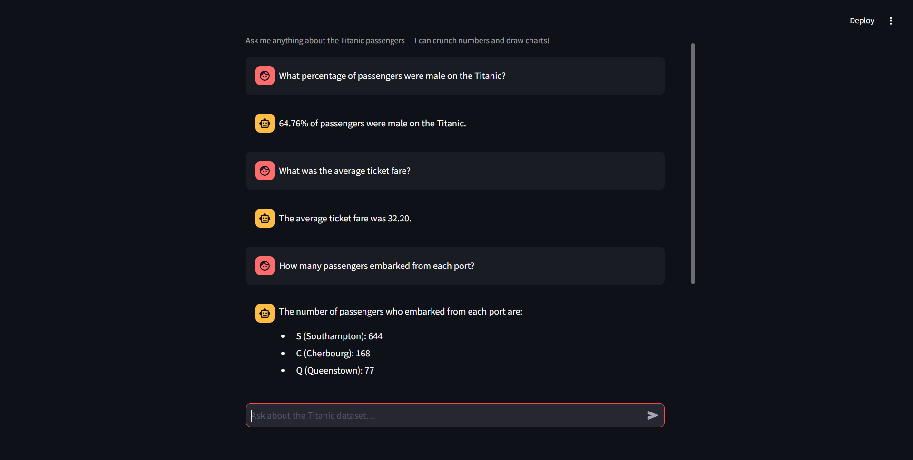
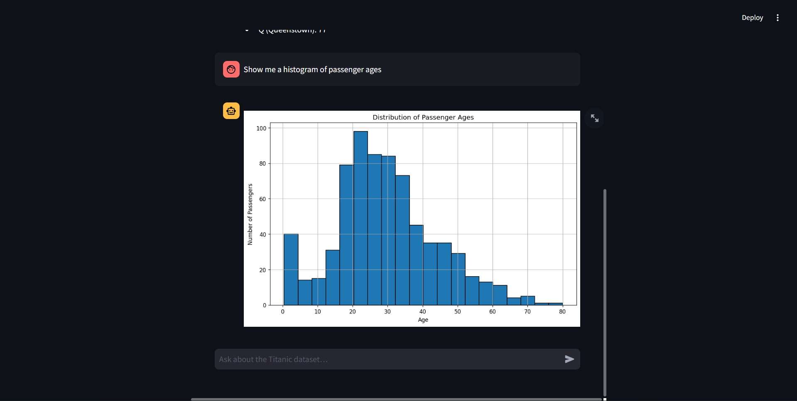

# 🚢 Titanic Dataset Chat Agent

An AI-powered chat agent that lets you explore the Titanic dataset through natural language. Ask questions, get instant answers, and generate visualizations — all in a conversational interface.

## Screenshots

| Chat Q&A                         | Chart Generation                         |
| -------------------------------- | ---------------------------------------- |
|  |  |

## How It Works

```
┌──────────────┐       HTTP        ┌──────────────────┐       LangChain       ┌─────────────────┐
│   Streamlit  │  ──── /chat ────► │   FastAPI Server │  ───── Agent ────────► │  Gemini 2.5     │
│   Frontend   │  ◄── response ──  │   (main.py)      │  ◄── answer/chart ──  │  Flash (Google) │
└──────────────┘                   └──────────────────┘                        └─────────────────┘
```

1. **Streamlit Frontend** (`app.py`) — A chat UI where users type questions about the Titanic dataset.
2. **FastAPI Backend** (`main.py`) — Receives questions via `/chat`, runs a LangChain pandas agent that can:
   - Query the dataset using pandas operations
   - Generate matplotlib charts and serve them via `/charts/{filename}`
3. **Gemini 2.5 Flash** — The LLM powering the agent, accessed via a Google AI Studio API key.

### Key Features

- **Natural language data analysis** — Ask questions like _"What was the survival rate by gender?"_ and get precise answers.
- **Automatic chart generation** — Request any visualization and the agent creates and displays it inline.
- **Irrelevant question guardrail** — Off-topic questions are politely declined without wasting API calls.
- **Fuzzy response caching** — Similar questions (e.g., _"average fare"_ vs _"average fare of the titanic"_) return cached answers instantly, saving API usage.

## Tech Stack

| Component    | Technology                         |
| ------------ | ---------------------------------- |
| LLM          | Google Gemini 2.5 Flash            |
| AI Framework | LangChain (Pandas DataFrame Agent) |
| Backend      | FastAPI + Uvicorn                  |
| Frontend     | Streamlit                          |
| Data         | Pandas, Matplotlib                 |

## Project Setup

### Prerequisites

- Python 3.11+
- A [Google AI Studio](https://aistudio.google.com/) API key

### 1. Clone the repository

```bash
git clone <your-repo-url>
cd tailor-talk
```

### 2. Create a virtual environment

```bash
python -m venv venv

# Windows
venv\Scripts\activate

# macOS / Linux
source venv/bin/activate
```

### 3. Install dependencies

```bash
pip install -r requirements.txt
```

### 4. Configure environment variables

Copy the example env file and add your API key:

```bash
cp .env.example .env
```

Edit `.env` and set:

```
GOOGLE_API_KEY=your-google-ai-studio-api-key
API_URL=http://localhost:8000
```

### 5. Run the application

Start the **FastAPI backend** and **Streamlit frontend** in two separate terminals:

```bash
# Terminal 1 — Backend
python main.py
```

```bash
# Terminal 2 — Frontend
streamlit run app.py
```

Open [http://localhost:8501](http://localhost:8501) in your browser and start chatting!

## Project Structure

```
tailor-talk/
├── main.py              # FastAPI backend + LangChain agent
├── app.py               # Streamlit chat frontend
├── data/
│   └── Titanic-Dataset.csv
├── charts/              # Auto-generated chart images
├── screenshots/
│   ├── ss1.png
│   └── ss2.png
├── requirements.txt
├── .env.example
└── .gitignore
```
